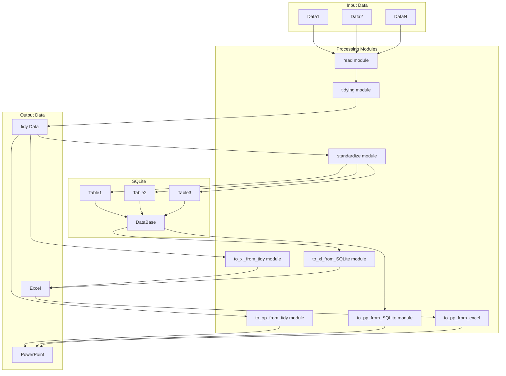

# mermaid test

```mermaid
graph TD
    subgraph Input Data
        I1[Data1]
        I2[Data2]
        IN[DataN]
    end

    subgraph Processing Modules
        M1[read module]
        M2[tidying module]
        M3[standardize module]
        M4[to_xl_from_tidy module]
        M5[to_xl_from_SQLite module]
        M6[to_pp_from_tidy module]
        M7[to_pp_from_SQLite module]
        M8[to_pp_from_excel]
    end

    subgraph Output Data
        O1[Excel]
        O2[PowerPoint]
        O3[tidy Data]
    end

    subgraph SQLite
        D0[DataBase]
        D1[Table1]
        D2[Table2]
        D3[Table3]
    end

    I1 & I2 & IN --> M1
    M1 --> M2
    M2 --> O3
    O3 --> M3
    O3 --> M4
    O3 --> M6
    M6 --> O2
    M3 --> D1 & D2 & D3
    D1 & D2 & D3 --> D0
    D0 --> M5
    D0 --> M7
    M7 --> O2
    M4 --> O1
    M5 --> O1
    O1 --> M8
    M8 --> O2

```
